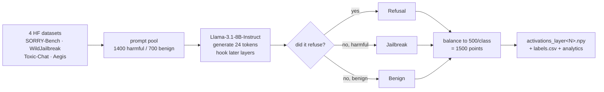

# Runbook — collecting Llama activations

For whoever is running the GPU box. Follow it top to bottom; the dry run is the gate.

> **The one thing that matters.** `step1_collect_activations.py` writes to fixed filenames
> (`labels.csv`, `collection_meta.json`, `activations_layer<N>.npy`) with no model in any path.
> Running it directly against Llama **overwrites the committed Qwen data in place.**
> `run_llama.py` exists to prevent that. Use it. Do not call `step1` yourself.

---

## What you are producing



Labels come from **what the model actually did**, not from prompt intent — so "Jailbreak" means
the model complied with a harmful request, which is the class the whole study is about.

---

## Step 1 — Preflight (do this first, it loads nothing)

```bash
python experiment1/pipeline/run_llama.py --dry-run
```

Checks CUDA, VRAM, bitsandbytes, transformers, **model access**, disk, and datasets, then prints
the exact layer list it would collect. A gated-repo failure surfaces here on `config.json`,
before any 16 GB download.

You want every line `PASS`. `WARN` is survivable; `FAIL` blocks and the script exits non-zero.

| If preflight says | Do this |
|---|---|
| `CUDA device is visible` FAIL | You are on a machine without a GPU. Collection cannot run. |
| `model config is reachable` FAIL | Accept the terms on the model's HF page, then `huggingface-cli login` (or `export HF_TOKEN=hf_...`). Llama-3.1 is **gated**. |
| `bitsandbytes` FAIL | `pip install bitsandbytes` — or pass `--no-4bit` if you have the VRAM for bf16 (~16 GB). |
| `VRAM is sufficient` WARN | See the VRAM table below; drop `--batch-size`. |
| `disk space` WARN | Weights ~16 GB + activations ~0.5 GB (496 MB measured). Free some room. |

---

## Step 2 — Collect

```bash
python experiment1/pipeline/run_llama.py
```

Defaults deliberately mirror the Qwen run so the two are comparable, not merely similar:

| setting | value | why |
|---|---|---|
| `--per-class` | 500 | balanced 1500 total, same as Qwen |
| `--harmful-pool` / `--benign-pool` | 1400 / 700 | same draw as Qwen |
| `--batch-size` | 4 | lower it if you OOM |
| `--max-new-tokens` | 24 | enough to detect a refusal |
| 4-bit | on | `--no-4bit` for bf16 |
| seed | 0 | fixed |

**Layers — the back half only.** Experiment 1's reported Qwen result was layer 30 of 36
(**0.83 of depth**), so the deep end is the region worth resolving. For Llama-3.1-8B (32 layers)
the default is:

```
16, 18, 20, 22, 24, 26, 28, 30, 32      (9 layers)
```

Override with `--layers 20,24,28,32` if you want it cheaper, or `--stride 1` for every block.

### VRAM

Qwen-3B peaked at **4.25 GB allocated / 8.23 GB reserved** on an 8 GB RTX 5070 Laptop. Llama-8B
is bigger:

| your VRAM | recommendation |
|---|---|
| 8 GB | 4-bit, `--batch-size 2`. Tight but should fit. |
| 12–16 GB | 4-bit, default `--batch-size 4`. Comfortable. |
| 24 GB+ | `--no-4bit --batch-size 8` for bf16 if you prefer no quantisation. |

### How long

Qwen-3B took **12.4 min** of collection (plus 33 s prompts, 14 s model load). Llama-8B is ~2.7×
the parameters — **budget 30–60 min**, plus a one-time ~16 GB weight download.

---

## Step 3 — Confirm it landed

Everything goes to a per-model directory. **Nothing in `experiment1/data/*.csv` is touched.**

```
experiment1/data/runs/Llama-3.1-8B-Instruct/
├── activations_layer16.npy … activations_layer32.npy    ← 9 files, ~23 MB each
├── activations_full_layer16.npy …                       ← unbalanced, provenance
├── labels.csv            1500 rows, balanced
├── labels_full.csv       ~2000 rows
├── collection_meta.json  model id, layers, class counts
└── analytics/run_<ts>.json   per-layer mean_norm / std_norm per class
```

Sanity-check before you walk away:

```bash
python - <<'PY'
import json, glob, numpy as np, pandas as pd
d = "experiment1/data/runs/Llama-3.1-8B-Instruct/"
m = json.load(open(d + "collection_meta.json"))
print("model      ", m["model_id"])
print("layers     ", m["layers"])
print("hidden dim ", m["hidden_dim"])
print("balanced   ", m["balanced_class_counts"])
lab = pd.read_csv(d + "labels.csv")
print("label rows ", len(lab), dict(lab.class_label.value_counts()))
for f in sorted(glob.glob(d + "activations_layer*.npy"))[:2]:
    print(f.split('/')[-1], np.load(f).shape)
PY
```

**Red flags.** Any class far from 500 means the refusal detector behaved differently on Llama —
report the actual counts rather than re-running with different settings. `hidden_dim` should be
**4096** for Llama-3.1-8B (Qwen-3B was 2048).

---

## Step 4 — Send back

`experiment1/data/` is gitignored, so **do not commit any of this.** Two options:

- **Everything** (~500 MB) — needed to run the Experiment 2 geometry on real activations. Zip
  the `runs/Llama-3.1-8B-Instruct/` directory and drop it on a drive.
- **Small only** (~2 MB) — `collection_meta.json`, `analytics/run_*.json`, `labels.csv`. Enough
  for norm statistics and class balance; **not** enough for the power diagrams.

---

## Known gaps — read before interpreting anything

1. **The layer CSVs are single-model.** `power_diagram.csv`, `layer_transition.csv` and
   `layer_diagnostics.csv` carry no model column and are produced by steps 2/3, which still
   write to the flat `experiment1/data/`. They currently describe **Qwen only**. Running the
   downstream steps on Llama would overwrite them the same way step 1 would have — that plumbing
   is not built yet. Tonight is collection only.
2. **`experiment2/lib/exp1_stats.py` refuses to guess.** With more than one analytics run present
   it raises rather than attributing untagged CSVs to a model. That is deliberate; it is also why
   the Llama run lives in its own directory instead of alongside Qwen's.
3. **`step1`'s default model is `meta-llama/Llama-3.1-8B-Instruct`** and `experiment1/README.md`
   documents Llama throughout — but the committed data is **Qwen2.5-3B-Instruct**, passed via
   `--model`. The README describes the default, not the run.
4. **Nothing here has been executed on a GPU by us.** The runner's preflight, layer selection,
   slug handling and output redirection are tested; the collection path itself is exercised for
   the first time by whoever runs this. Report failures verbatim.
